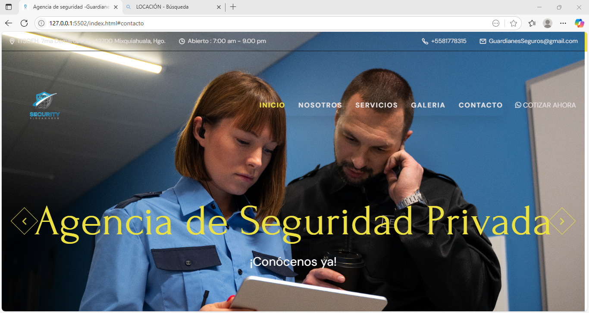

<div align="center">
  
  
  
  
[](https://twitter.com/intent/follow?screen_name=codewithsadee_)
  [](https://youtu.be/CjVGp5kGHxA)

  <br />
  <br />

  <h2 align="center">Agencia de Seguridad Privada-Guardianes Seguros</h2>

  Guardianes Seguros is a fully responsive restaurant website, <br />Responsive for all devices, build using HTML, CSS, and JavaScript.

  <a href="https://github.com/brenda19011/Desarrollador.github.io.git/"><strong>➥ Live Demo</strong></a>

</div>

<br />
Propósito
En Guardianes Seguros, nuestro propósito es proteger la integridad física, patrimonial y emocional de las personas, empresas y comunidades, ofreciendo soluciones integrales de seguridad privada con profesionalismo, ética y compromiso. Nos guiamos por la firme convicción de generar confianza, tranquilidad y respaldo a nuestros clientes, mediante servicios preventivos y correctivos de alta calidad, tecnología avanzada y personal capacitado.

Características principales 
I.-Diseño responsivo (responsive design)
Adaptable a todos los dispositivos (móviles, tabletas, computadoras).
Layout flexible con media queries.
Uso de sistemas de rejilla (grid/flexbox) para orden visual eficiente.

II.-Optimización SEO (Search Engine Optimization)
Uso correcto de etiquetas HTML semánticas (<header>, <section>, <article>, <footer>).
Metaetiquetas optimizadas (<meta name="description">, <meta name="keywords">, <title>).
Contenido estructurado para indexación efectiva en motores de búsqueda.
Carga rápida y reducción de recursos innecesarios (minificación de CSS/JS).

III.-URLs amigables (Friendly URLs)
Rutas limpias y legibles para el usuario y motores de búsqueda (ej: /servicios, /nosotros, /contacto).
Sin caracteres especiales, parámetros largos ni extensiones innecesarias.

IV.-Estilos UI/UX modernos
Paleta de colores institucional (ej. negro, dorado, blanco).
Tipografía clara, profesional y accesible.
Botones llamativos y bien posicionados con efectos de hover.
Uso de iconografía y animaciones suaves para mejorar la experiencia de navegación.
Jerarquía visual con subtítulos, bloques de contenido y tarjetas informativas.

V.-Componentes reutilizables (UI reutilizable)
Menús, botones, formularios y tarjetas modulares reutilizables.
Estilos centralizados con variables CSS (por ejemplo: --gold-crayola, --weight-bold).
Separación clara entre estructura HTML, estilos CSS y comportamiento JS.

VI.-Accesibilidad (A11Y)
Texto con suficiente contraste de color.
Navegación por teclado y lectores de pantalla.
Atributos alt en imágenes y roles en componentes interactivos.

VII.-Integración con herramientas externas
Botón de contacto vía WhatsApp.
Mapa de ubicación integrado (Google Maps o similar).
Formularios de contacto funcionales con validación.

VIII.-Seguridad y confianza
licencia
Políticas de privacidad y términos de uso visibles.
Pie de página con enlaces legales y redes sociales.

Tecnologías Utilizadas
I.-HTML
Estructura semántica del sitio
II.-CSS 
Estilización avanzada, diseño responsivo con media queries, animaciones y variables.
III.-JavaScript
Interactividad del sitio: sliders, menús desplegables, validaciones de formularios, etc.

IV.-Frameworks y bibliotecas opcionales
Bootstrap o CSS: para UI rápida, responsiva y consistente.
Swiper.js: para carruseles de imágenes o testimonios.

V.-Versionamiento y despliegue
Git + GitHub
Control de versiones y colaboración en equipo.

Hosting personalizado
Para subir archivos al servidor.

VI.-Canva 
Para diseño gráfico o prototipos UI previos.


### Demo Screeshots



Estructura del proyecto
guardianes-seguros/
│
├── index.html                 ← Página principal
├── nosotros.html              ← Página de "Quiénes somos"
├── servicios.html             ← Página de servicios ofrecidos
├── contacto.html              ← Formulario de contacto
├── politicas.html             ← Políticas de servicio
├── terminos.html              ← Términos de uso
│
├── assets/                    ← Carpeta de recursos estáticos
│   ├── css/
│   │   ├── style.css          ← Estilos principales del sitio
│   │   └── responsive.css     ← Estilos adaptativos (media queries)
│   │
│   ├── js/
│   │   ├── main.js            ← Funciones JS generales (menú, sliders, validaciones)
│   │   └── contacto.js        ← Validación del formulario de contacto
│   │
│   ├── img/
│   │   ├── logo.png           ← Logo de la empresa
│   │   ├── banner.jpg         ← Imagen del encabezado
│   │   └── (otras imágenes)   ← Íconos, fondos, etc.
│   │
│   └── fonts/                 ← Tipografías personalizadas o Google Fonts descargadas
│
├── components/                ← Partes reutilizables (opcional si usas PHP o frameworks)
│   ├── header.html            ← Encabezado del sitio
│   ├── footer.html            ← Pie de página
│   └── navbar.html            ← Menú de navegación
│
├── php/                       ← Scripts PHP (si hay backend)
│   └── enviar-formulario.php ← Envío de formularios
│
├── .gitignore                 ← Archivos a ignorar por Git
├── README.md                  ← Descripción del proyecto
└── favicon.ico                ← Ícono de pestaña


### Prerequisites

Before you begin, ensure you have met the following requirements:

* [Git](https://git-scm.com/downloads "Download Git") must be installed on your operating system.

### Run Locally

To run **Guardianes Seguros** locally, run this command on your git bash:

Linux and macOS:

```bash
sudo git clone https://github.com/brenda19011/Desarrollador.github.io.git
```

Windows:

```bash
git clone https://github.com/brenda19011/Desarrollador.github.io.git
```

### Contact

If you want to contact with me you can reach me at [Twitter](https://www.twitter.com/codewithsadee).

### License

[MIT](https://choosealicense.com/licenses/mit/)
